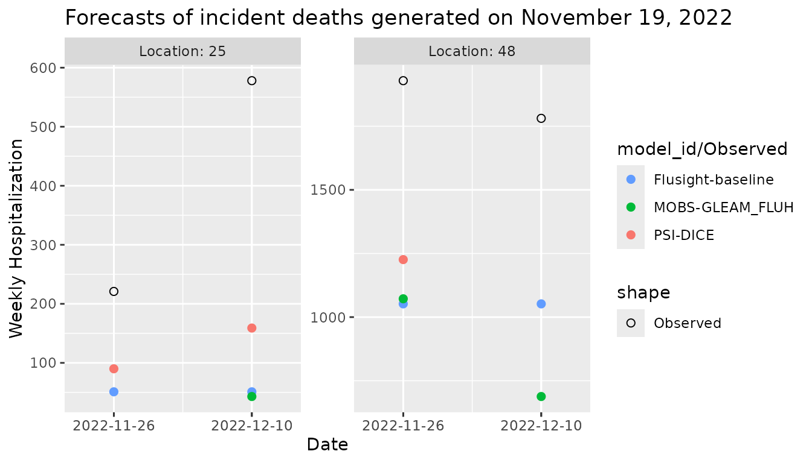

# Simple working examples

This vignette demonstrates the usage of the `modelimportance` package
for evaluating how each component model contributes to ensemble
accuracy. We provide simple working examples to help you get started
with the package. Detailed descriptions of the model importance metrics,
algorithms, key functions, and in-depth interpretations of the examples
covered here are available in the [accompanying
article](https://mkim425.github.io/modelimportance/articles/modelimportance-article.html)
titled ‘`modelimportance`: Evaluating model importance within a
multi-model ensemble in R’ under *Articles*.

## Setup

We first load the necessary packages.

``` r
library(hubExamples)
library(modelimportance)
library(dplyr)
library(ggplot2)
```

We use some example forecast and target data from the `hubExamples`
package, which provides sample datasets for multiple modeling hubs in
the hubverse format.

## Example data

The forecast data used here contains forecasts of weekly incident
influenza hospitalizations in the US for Massachusetts (FIPS code 25)
and Texas (FIPS code 48), generated on November 19, 2022. These
forecasts are for two target end dates, November 26, 2022 (horizon 1),
and December 10, 2022 (horizon 3), and were produced by three models:
‘Flusight-baseline’, ‘MOBS-GLEAM_FLUH’, and ‘PSI-DICE’. The output type
is `median` and the `output_type_id` column has `NA`s as no further
specification is required for this output type. We have modified the
example data slightly: some forecasts have been removed to demonstrate
the handling of missing values. Therefore, MOBS-GLEAM_FLUH’s forecast
for Massachusetts on November 26, 2022, and PSI-DICE’s forecast for
Texas on December 10, 2022, are missing.

``` r
forecast_data <- hubExamples::forecast_outputs |>
  dplyr::filter(
    output_type %in% c("median"),
    target_end_date %in% as.Date(c("2022-11-26", "2022-12-10"))
  ) |>
  filter(
    !(
      model_id == "MOBS-GLEAM_FLUH" &
        location == "25" &
        target_end_date == as.Date("2022-11-26")
    ),
    !(
      model_id == "PSI-DICE" &
        location == "48" &
        target_end_date == as.Date("2022-12-10")
    )
  )

forecast_data |>
  knitr::kable(
    format = "html"
  ) |>
  kableExtra::kable_styling(
    font_size = 12,
    bootstrap_options = c("striped", "hover", "condensed", "responsive"),
    full_width = TRUE
  )
```

| model_id          | reference_date | target          | horizon | location | target_end_date | output_type | output_type_id | value |
|:------------------|:---------------|:----------------|--------:|:---------|:----------------|:------------|:---------------|------:|
| Flusight-baseline | 2022-11-19     | wk inc flu hosp |       1 | 25       | 2022-11-26      | median      | NA             |    51 |
| Flusight-baseline | 2022-11-19     | wk inc flu hosp |       3 | 25       | 2022-12-10      | median      | NA             |    51 |
| Flusight-baseline | 2022-11-19     | wk inc flu hosp |       1 | 48       | 2022-11-26      | median      | NA             |  1052 |
| Flusight-baseline | 2022-11-19     | wk inc flu hosp |       3 | 48       | 2022-12-10      | median      | NA             |  1052 |
| MOBS-GLEAM_FLUH   | 2022-11-19     | wk inc flu hosp |       3 | 25       | 2022-12-10      | median      | NA             |    43 |
| MOBS-GLEAM_FLUH   | 2022-11-19     | wk inc flu hosp |       1 | 48       | 2022-11-26      | median      | NA             |  1072 |
| MOBS-GLEAM_FLUH   | 2022-11-19     | wk inc flu hosp |       3 | 48       | 2022-12-10      | median      | NA             |   688 |
| PSI-DICE          | 2022-11-19     | wk inc flu hosp |       1 | 25       | 2022-11-26      | median      | NA             |    90 |
| PSI-DICE          | 2022-11-19     | wk inc flu hosp |       3 | 25       | 2022-12-10      | median      | NA             |   159 |
| PSI-DICE          | 2022-11-19     | wk inc flu hosp |       1 | 48       | 2022-11-26      | median      | NA             |  1226 |

The corresponding target data contains the observed hospitalization
counts for these dates and locations.

``` r
target_data <- hubExamples::forecast_target_ts |>
  dplyr::filter(
    target_end_date %in% unique(forecast_data$target_end_date),
    location %in% unique(forecast_data$location),
    target == "wk inc flu hosp"
  ) |>
  # Rename columns to match the oracle output format
  rename(oracle_value = observation)

target_data |>
  knitr::kable(
    format = "html"
  ) |>
  kableExtra::kable_styling(
    bootstrap_options = c("striped", "hover", "condensed", "responsive"),
    full_width = TRUE
  )
```

| target_end_date | target          | location | oracle_value |
|:----------------|:----------------|:---------|-------------:|
| 2022-11-26      | wk inc flu hosp | 25       |          221 |
| 2022-11-26      | wk inc flu hosp | 48       |         1929 |
| 2022-12-10      | wk inc flu hosp | 25       |          578 |
| 2022-12-10      | wk inc flu hosp | 48       |         1781 |

We visualize the forecasts and the observed values.

``` r
forecast_data |>
  ggplot(aes(x = target_end_date)) +
  geom_point(aes(y = value, color = model_id), size = 2) +
  facet_wrap(~location,
    scales = "free_y",
    labeller = labeller(location = function(x) paste0("Location: ", x))
  ) +
  geom_point(
    data = target_data,
    aes(y = oracle_value, group = 1, shape = "Observed"),
    alpha = 1, size = 2
  ) +
  scale_x_date(
    breaks = target_data$target_end_date,
    date_labels = "%Y-%m-%d", expand = expansion(add = c(5, 5))
  ) +
  scale_color_manual(
    name = "model_id/Observed",
    values = c(
      "Flusight-baseline" = "#619CFF",
      "MOBS-GLEAM_FLUH" = "#00BA38", "PSI-DICE" = "#F8766D"
    ),
    limits = c("Flusight-baseline", "MOBS-GLEAM_FLUH", "PSI-DICE")
  ) +
  scale_shape_manual(values = c("Observed" = 1)) +
  labs(
    x = "Date", y = "Weekly Hospitalization",
    title = "Forecasts of incident deaths generated on November 19, 2022"
  )
```



As expected, prediction errors increase at longer horizons due to
greater uncertainty, with forecasts for December 10, 2022, showing
larger deviations from the observed values compared to those for
November 26, 2022. Additionally, the forecasts for Massachusetts are
relatively more accurate compared to those for Texas, which tend to have
higher errors.

## Evaluation using LOMO algorithm

We quantify the contribution of each model within the ensemble using the
[`model_importance()`](https://mkim425.github.io/modelimportance/reference/model_importance.md)
function. The following code evaluates the importance of each ensemble
member in the simple mean ensemble using the LOMO algorithm.

``` r
scores_lomo <- model_importance(
  forecast_data = forecast_data, oracle_output_data = target_data,
  ensemble_fun = "simple_ensemble",
  importance_algorithm = "lomo"
)

scores_lomo |>
  knitr::kable(
    format = "html"
  ) |>
  kableExtra::kable_styling(
    font_size = 12,
    bootstrap_options = c("striped", "hover", "condensed", "responsive"),
    full_width = TRUE
  )
```

| model_id          | reference_date | target          | horizon | location | target_end_date | output_type | importance |
|:------------------|:---------------|:----------------|--------:|:---------|:----------------|:------------|-----------:|
| Flusight-baseline | 2022-11-19     | wk inc flu hosp |       1 | 25       | 2022-11-26      | median      |  -19.50000 |
| MOBS-GLEAM_FLUH   | 2022-11-19     | wk inc flu hosp |       1 | 25       | 2022-11-26      | median      |         NA |
| PSI-DICE          | 2022-11-19     | wk inc flu hosp |       1 | 25       | 2022-11-26      | median      |   19.50000 |
| Flusight-baseline | 2022-11-19     | wk inc flu hosp |       1 | 48       | 2022-11-26      | median      |  -32.33333 |
| MOBS-GLEAM_FLUH   | 2022-11-19     | wk inc flu hosp |       1 | 48       | 2022-11-26      | median      |  -22.33333 |
| PSI-DICE          | 2022-11-19     | wk inc flu hosp |       1 | 48       | 2022-11-26      | median      |   54.66667 |
| Flusight-baseline | 2022-11-19     | wk inc flu hosp |       3 | 25       | 2022-12-10      | median      |  -16.66667 |
| MOBS-GLEAM_FLUH   | 2022-11-19     | wk inc flu hosp |       3 | 25       | 2022-12-10      | median      |  -20.66667 |
| PSI-DICE          | 2022-11-19     | wk inc flu hosp |       3 | 25       | 2022-12-10      | median      |   37.33333 |
| Flusight-baseline | 2022-11-19     | wk inc flu hosp |       3 | 48       | 2022-12-10      | median      |  182.00000 |
| MOBS-GLEAM_FLUH   | 2022-11-19     | wk inc flu hosp |       3 | 48       | 2022-12-10      | median      | -182.00000 |
| PSI-DICE          | 2022-11-19     | wk inc flu hosp |       3 | 48       | 2022-12-10      | median      |         NA |

For models that missed forecasts for certain tasks, `NA` values are
assigned in the importance column for those tasks.

We summarize the importance scores for each model by averaging across
all tasks. `NA` values are removed during the averaging process by
setting the `na_action` argument to `"drop"`.

``` r
summary.lomo.drop <- model_importance_summary(
  scores_lomo,
  by = "model_id", na_action = "drop", fun = mean
)

summary.lomo.drop |>
  knitr::kable(
    format = "html"
  ) |>
  kableExtra::kable_styling(
    bootstrap_options = c("striped", "hover", "condensed", "responsive"),
    full_width = TRUE
  )
```

| model_id          | importance_score_mean |
|:------------------|----------------------:|
| PSI-DICE          |              37.16667 |
| Flusight-baseline |              28.37500 |
| MOBS-GLEAM_FLUH   |             -75.00000 |

The results show that the model ‘PSI-DICE’ has the highest importance
score, followed by ‘Flusight-baseline’ and ‘MOBS-GLEAM_FLUH’. That is,
‘PSI-DICE’ contributes the most to improving the ensemble’s predictive
performance, whereas ‘MOBS-GLEAM_FLUH’, which has a negative score,
detracts from the ensemble’s performance.

Another approach to handling `NA` values is to use the `"worst"` option
for `na_action`, which replaces `NA` values with the worst (i.e.,
minimum) score among the other models for the same task.

``` r
summary.lomo.worst <- model_importance_summary(
  scores_lomo,
  by = "model_id", na_action = "worst", fun = mean
)

summary.lomo.worst |>
  knitr::kable(
    format = "html"
  ) |>
  kableExtra::kable_styling(
    bootstrap_options = c("striped", "hover", "condensed", "responsive"),
    full_width = TRUE
  )
```

| model_id          | importance_score_mean |
|:------------------|----------------------:|
| Flusight-baseline |                28.375 |
| PSI-DICE          |               -17.625 |
| MOBS-GLEAM_FLUH   |               -61.125 |

The results show that the importance scores of ‘Flusight-baseline’ is
unchanged because it has no missing forecast. We observe that the
importance score of ‘PSI-DICE’, which was previously positive, has now
decreased to a negative value when compared to the evaluation using the
`"drop"` option for `na_action`. Moreover, ‘MOBS-GLEAM_FLUH’ still ranks
the lowest, but the importance score has increased.

It is also possible to impute the missing scores with intermediate
values by assigning the average importance scores of other models in the
same task. This strategy may offer a more balanced trade-off by
mitigating the influence of the missing data without overly penalizing
or overlooking them.

``` r
summary.lomo.avg <- model_importance_summary(
  scores_lomo,
  by = "model_id", na_action = "average", fun = mean
)

summary.lomo.avg |>
  knitr::kable(
    format = "html"
  ) |>
  kableExtra::kable_styling(
    bootstrap_options = c("striped", "hover", "condensed", "responsive"),
    full_width = TRUE
  )
```

| model_id          | importance_score_mean |
|:------------------|----------------------:|
| Flusight-baseline |                28.375 |
| PSI-DICE          |                27.875 |
| MOBS-GLEAM_FLUH   |               -56.250 |

## Evaluation using LASOMO algorithm

Now we demonstrate the use of the LASOMO algorithm in the evaluation of
model importance. As we explored the difference of `na_action` options
in the previous LOMO example, we focus on options for `subset_wt`, which
specifies how weights are assigned to subsets of models when calculating
importance scores, with `na_action` fixed to `"drop"`.

The following code and corresponding outputs illustrate the evaluation
using each weighting scheme.

``` r
# LASOMO - equal weights
scores_lasomo_eq <- model_importance(
  forecast_data = forecast_data, oracle_output_data = target_data,
  ensemble_fun = "simple_ensemble",
  importance_algorithm = "lasomo", subset_wt = "equal"
)

summary.lasomo_eq <- model_importance_summary(
  scores_lasomo_eq,
  by = "model_id", na_action = "drop", fun = mean
)

summary.lasomo_eq |>
  knitr::kable(
    format = "html"
  ) |>
  kableExtra::kable_styling(
    bootstrap_options = c("striped", "hover", "condensed", "responsive"),
    full_width = TRUE
  )
```

| model_id          | importance_score_mean |
|:------------------|----------------------:|
| PSI-DICE          |              47.38889 |
| Flusight-baseline |              24.29167 |
| MOBS-GLEAM_FLUH   |             -79.77778 |

``` r
# LASOMO - perm based weights
scores_lasomo_perm <- model_importance(
  forecast_data = forecast_data,
  oracle_output_data = target_data,
  ensemble_fun = "simple_ensemble",
  importance_algorithm = "lasomo", subset_wt = "perm_based"
)

summary.lasomo_perm <- model_importance_summary(
  scores_lasomo_perm,
  by = "model_id", na_action = "drop", fun = mean
)

summary.lasomo_perm |>
  knitr::kable(
    format = "html"
  ) |>
  kableExtra::kable_styling(
    bootstrap_options = c("striped", "hover", "condensed", "responsive"),
    full_width = TRUE
  )
```

| model_id          | importance_score_mean |
|:------------------|----------------------:|
| PSI-DICE          |              44.83333 |
| Flusight-baseline |              25.31250 |
| MOBS-GLEAM_FLUH   |             -78.58333 |

In this example, there are only three models ($n = 3$), and the weights
do not differ significantly between the two weighting schemes.
Therefore, the resulting outputs show little difference. However, in
general, with a larger number of models, the two weighting schemes may
yield different importance scores for each model.

Note that the computational time here is about 0.3 seconds for both LOMO
and LASOMO algorithms. However, this time can be increased substantially
with a large number of models and tasks. See detailed discussions on
execution time and computational feasibility in the [Computational
complexity](https://mkim425.github.io/modelimportance/articles/modelimportance-article.html#sec:computational-complexity)
section of the accompanying article.

An extensive application in more complex scenarios with a larger number
of models can be found in Kim, Ray, and Reich (2024).

## References

Kim, Minsu, Evan L. Ray, and Nicholas G. Reich. 2024. “Beyond forecast
leaderboards: Measuring individual model importance based on
contribution to ensemble accuracy.” <https://arxiv.org/abs/2412.08916>.
