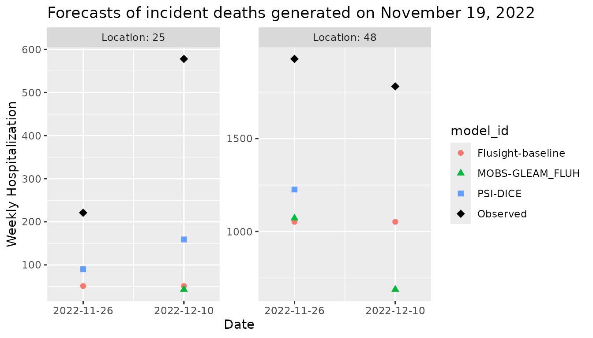
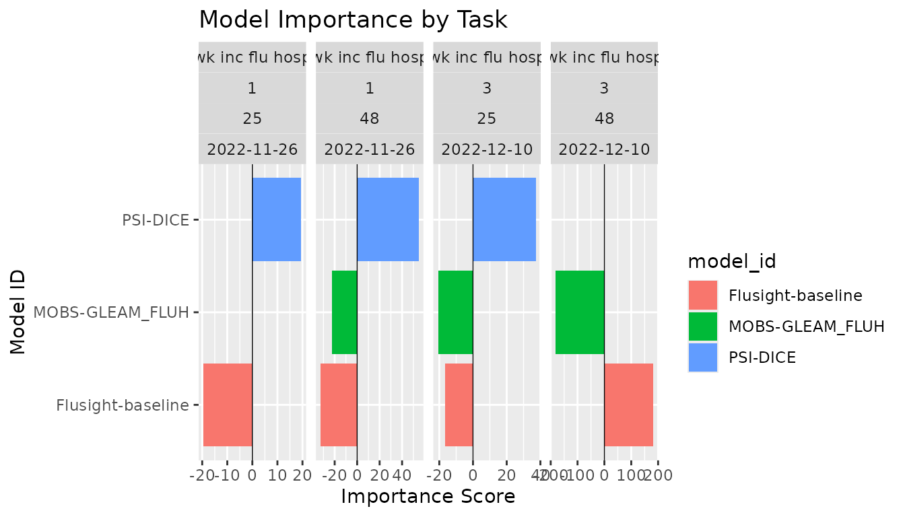

# Simple working examples

This vignette demonstrates the usage of the `modelimportance` package
for evaluating how each component model contributes to ensemble
accuracy. We provide simple working examples to help you get started
with the package. Detailed descriptions of the model importance metrics,
algorithms, key functions, and in-depth interpretations of the examples
covered here are available in the [accompanying
article](https://mkim425.github.io/modelimportance/articles/modelimportance-article.md)
titled ‘`modelimportance`: Evaluating model importance within a
multi-model ensemble in R’ under *Articles*.

## Setup

We first load the necessary packages.

``` r

library(modelimportance)
library(dplyr)
library(ggplot2)
```

We use example forecast and target data bundled in the `modelimportance`
package, originally from the `hubExamples` package that provides sample
datasets for multiple modeling hubs in the hubverse format.

## Example data

The forecast data used here contains forecasts of weekly incident
influenza hospitalizations in the US for Massachusetts (FIPS code 25)
and Texas (FIPS code 48), generated on November 19, 2022. These
forecasts are made for two target end dates, November 26, 2022 (horizon
1), and December 10, 2022 (horizon 3), and were produced by three
models: ‘Flusight-baseline’, ‘MOBS-GLEAM_FLUH’, and ‘PSI-DICE’. The
output type is `median` and the `output_type_id` column has `NA`s as no
further specification is required for this output type. We have modified
the example data slightly by removing some forecasts to demonstrate the
handling of missing values. Therefore, MOBS-GLEAM_FLUH’s forecast for
Massachusetts on November 26, 2022, and PSI-DICE’s forecast for Texas on
December 10, 2022, are missing.

``` r

# Specify forecasts to remove: MOBS-GLEAM_FLUH for location 25 on 2022-11-26,
# PSI-DICE for location 48 on 2022-12-10
forecast_to_remove <- tibble(
  model_id = c("MOBS-GLEAM_FLUH", "PSI-DICE"),
  location = c("25", "48"),
  target_end_date = as.Date(c("2022-11-26", "2022-12-10"))
)

# Filter out the specified forecasts from the original data
forecast_data <- forecast_data_raw |>
  anti_join(forecast_to_remove, by = c("model_id", "location", "target_end_date"))

# Display the forecast data
forecast_data
#> # A tibble: 10 × 9
#>    model_id          reference_date target          horizon location target_end_date output_type output_type_id value
#>    <chr>             <date>         <chr>             <int> <chr>    <date>          <chr>       <chr>          <dbl>
#>  1 Flusight-baseline 2022-11-19     wk inc flu hosp       1 25       2022-11-26      median      NA                51
#>  2 Flusight-baseline 2022-11-19     wk inc flu hosp       3 25       2022-12-10      median      NA                51
#>  3 Flusight-baseline 2022-11-19     wk inc flu hosp       1 48       2022-11-26      median      NA              1052
#>  4 Flusight-baseline 2022-11-19     wk inc flu hosp       3 48       2022-12-10      median      NA              1052
#>  5 MOBS-GLEAM_FLUH   2022-11-19     wk inc flu hosp       3 25       2022-12-10      median      NA                43
#>  6 MOBS-GLEAM_FLUH   2022-11-19     wk inc flu hosp       1 48       2022-11-26      median      NA              1072
#>  7 MOBS-GLEAM_FLUH   2022-11-19     wk inc flu hosp       3 48       2022-12-10      median      NA               688
#>  8 PSI-DICE          2022-11-19     wk inc flu hosp       1 25       2022-11-26      median      NA                90
#>  9 PSI-DICE          2022-11-19     wk inc flu hosp       3 25       2022-12-10      median      NA               159
#> 10 PSI-DICE          2022-11-19     wk inc flu hosp       1 48       2022-11-26      median      NA              1226
```

The corresponding target data contains the observed hospitalization
counts for these dates and locations.

``` r

target_data <- target_data_raw |>
  dplyr::filter(
    target_end_date %in% unique(forecast_data$target_end_date),
    location %in% unique(forecast_data$location),
    target == "wk inc flu hosp"
  )

target_data
#> # A tibble: 4 × 4
#>   target_end_date target          location oracle_value
#>   <date>          <chr>           <chr>           <dbl>
#> 1 2022-11-26      wk inc flu hosp 25                221
#> 2 2022-11-26      wk inc flu hosp 48               1929
#> 3 2022-12-10      wk inc flu hosp 25                578
#> 4 2022-12-10      wk inc flu hosp 48               1781
```

We plot the point (median) forecasts and the observed values to
visualize the difference in forecast errors.



When comparing the ground truth data and model predictions, we can see
that forecasts for December 10, 2022 show larger deviations from the
observed values compared to those for November 26, 2022. Thus, as we
expect, prediction errors increase at longer horizons due to greater
uncertainty. Additionally, the forecasts for Massachusetts are
relatively more accurate compared to those for Texas, which tend to have
higher errors.

## Evaluation using LOMO algorithm

We quantify the contribution of each model within the ensemble using the
[`model_importance()`](https://mkim425.github.io/modelimportance/reference/model_importance.md)
function. The following code evaluates the importance of each ensemble
member in the simple mean ensemble using the LOMO algorithm.

``` r

scores_lomo <- model_importance(
  forecast_data = forecast_data,
  oracle_output_data = target_data,
  ensemble_fun = "simple_ensemble",
  importance_algorithm = "lomo"
)

print(scores_lomo)
#> Model importance result by task
#> ---------------------------------
#>             model_id reference_date          target horizon location target_end_date output_type importance
#> 1  Flusight-baseline     2022-11-19 wk inc flu hosp       1       25      2022-11-26      median  -19.50000
#> 2    MOBS-GLEAM_FLUH     2022-11-19 wk inc flu hosp       1       25      2022-11-26      median         NA
#> 3           PSI-DICE     2022-11-19 wk inc flu hosp       1       25      2022-11-26      median   19.50000
#> 4  Flusight-baseline     2022-11-19 wk inc flu hosp       1       48      2022-11-26      median  -32.33333
#> 5    MOBS-GLEAM_FLUH     2022-11-19 wk inc flu hosp       1       48      2022-11-26      median  -22.33333
#> 6           PSI-DICE     2022-11-19 wk inc flu hosp       1       48      2022-11-26      median   54.66667
#> 7  Flusight-baseline     2022-11-19 wk inc flu hosp       3       25      2022-12-10      median  -16.66667
#> 8    MOBS-GLEAM_FLUH     2022-11-19 wk inc flu hosp       3       25      2022-12-10      median  -20.66667
#> 9           PSI-DICE     2022-11-19 wk inc flu hosp       3       25      2022-12-10      median   37.33333
#> 10 Flusight-baseline     2022-11-19 wk inc flu hosp       3       48      2022-12-10      median  182.00000
#> 11   MOBS-GLEAM_FLUH     2022-11-19 wk inc flu hosp       3       48      2022-12-10      median -182.00000
#> 12          PSI-DICE     2022-11-19 wk inc flu hosp       3       48      2022-12-10      median         NA
```

For models that missed forecasts for certain tasks, `NA` values were
assigned in the importance column for those tasks.

Calling [`summary()`](https://rdrr.io/r/base/summary.html) shows that
three models were used and four tasks were evaluated, along with a
preview of the top-performing model for each task.

``` r

summary(scores_lomo)
#> === Summary of importance scores by task ===
#> Number of models: 3 
#> Number of tasks: 4 
#> 
#> === Top scoring model by task for a subset of tasks ======================================== 
#>           target horizon location target_end_date top_model importance
#>  wk inc flu hosp       1       25      2022-11-26  PSI-DICE      19.50
#>  wk inc flu hosp       1       48      2022-11-26  PSI-DICE      54.67
#>  wk inc flu hosp       3       25      2022-12-10  PSI-DICE      37.33
#> --------------------------------------------
#> * More details are available in the summary object (e.g., $all_tasks, $model_summary, $task_winners).
```

As indicated in the output, more details about the summary are available
through the summary object’s elements as follows.

``` r

s <- summary(scores_lomo)
s$all_tasks
#>            target horizon location target_end_date
#> 1 wk inc flu hosp       1       25      2022-11-26
#> 2 wk inc flu hosp       1       48      2022-11-26
#> 3 wk inc flu hosp       3       25      2022-12-10
#> 4 wk inc flu hosp       3       48      2022-12-10
```

Each row represents a unique combination of task IDs, from which we
verify that four different tasks were evaluated.

``` r

s$model_summary
#>            model_id n_tasks min_importance max_importance n_NA
#> 1 Flusight-baseline       4         -32.33         182.00    0
#> 2   MOBS-GLEAM_FLUH       4        -182.00         -20.67    1
#> 3          PSI-DICE       4          19.50          54.67    1
```

We observe that ‘Flusight-baseline’ submitted forecasts for all four
tasks (`n_NA` = 0), while ‘MOBS-GLEAM_FLUH’ and ‘PSI-DICE’ submitted
forecasts for only three tasks due to one missing forecast (`n_NA` = 1).
Each model’s importance scores vary across tasks. ‘Flusight-baseline’
shows the largest range of scores that includes a negative minimum value
and a positive maximum value, while ‘MOBS-GLEAM_FLUH’ and ‘PSI-DICE’
have scores that are all positive or all negative across the three tasks
they submitted forecasts for.

``` r

s$task_winners
#>            target horizon location target_end_date         top_model max_score
#> 1 wk inc flu hosp       1       25      2022-11-26          PSI-DICE     19.50
#> 2 wk inc flu hosp       1       48      2022-11-26          PSI-DICE     54.67
#> 3 wk inc flu hosp       3       25      2022-12-10          PSI-DICE     37.33
#> 4 wk inc flu hosp       3       48      2022-12-10 Flusight-baseline    182.00
```

Models with the highest importance scores for each task are identified
in the `top_model` column with their importance score in the `max_score`
column. ‘PSI-DICE’ is the best model for three out of the four tasks,
while ‘Flusight-baseline’ is the best for the remaining task.

The following example shows a bar plot of importance scores across
models and tasks, with panels faceted by combinations of task ID values.



We aggregate the importance scores for each model by averaging across
all tasks. `NA` values are removed during the averaging process by
setting the `na_action` argument to `"drop"`.

``` r

aggregate(scores_lomo, by = "model_id", na_action = "drop", fun = mean)
#> Overall model importance across tasks
#> ---------------------------------------- 
#> # A tibble: 3 × 2
#>   model_id          importance_score_mean
#>   <chr>                             <dbl>
#> 1 PSI-DICE                           37.2
#> 2 Flusight-baseline                  28.4
#> 3 MOBS-GLEAM_FLUH                   -75
```

The results show that, overall, the model ‘PSI-DICE’ has the highest
importance score, followed by ‘Flusight-baseline’ and ‘MOBS-GLEAM_FLUH’.
That is, ‘PSI-DICE’ contributes the most to improving the ensemble’s
predictive performance, whereas ‘MOBS-GLEAM_FLUH’, which has a negative
score, detracts from the ensemble’s performance. The low importance
score of ‘MOBS-GLEAM_FLUH’ is mainly due to a substantially larger
prediction error for Texas on the target end date of December 10, 2022,
compared to other models, while its missing forecast for Massachusetts
for November 26, 2022, was not factored into the evaluation. This single
large error significantly affected its contribution score.

Another approach to handling missing values is to use the `"worst"`
option for `na_action`, which replaces missing values with the worst
(i.e., minimum) score among the other models for the same task.

``` r

aggregate(scores_lomo, by = "model_id", na_action = "worst", fun = mean)
#> Overall model importance across tasks
#> ---------------------------------------- 
#> # A tibble: 3 × 2
#>   model_id          importance_score_mean
#>   <chr>                             <dbl>
#> 1 Flusight-baseline                  28.4
#> 2 PSI-DICE                          -17.6
#> 3 MOBS-GLEAM_FLUH                   -61.1
```

It is also possible to impute the missing scores with intermediate
values by assigning the average importance scores of other models in the
same task. This strategy may offer a more balanced trade-off by
mitigating the influence of the missing data without overly penalizing
or overlooking them.

``` r

aggregate(scores_lomo, by = "model_id", na_action = "average", fun = mean)
#> Overall model importance across tasks
#> ---------------------------------------- 
#> # A tibble: 3 × 2
#>   model_id          importance_score_mean
#>   <chr>                             <dbl>
#> 1 Flusight-baseline                  28.4
#> 2 PSI-DICE                           27.9
#> 3 MOBS-GLEAM_FLUH                   -56.2
```

## Evaluation using LASOMO algorithm

We now demonstrate the use of the LASOMO algorithm for evaluating model
importance. Since we explored the difference of `na_action` options in
the previous LOMO example above, we focus on options for `subset_wt`,
which specifies how weights are assigned to subsets of models when
calculating importance scores, with `na_action` fixed to `"drop"`.

The following code and corresponding outputs illustrate the evaluation
using each weighting scheme.

``` r

scores_lasomo_eq <- model_importance(
  forecast_data = forecast_data,
  oracle_output_data = target_data,
  ensemble_fun = "simple_ensemble",
  importance_algorithm = "lasomo",
  subset_wt = "equal"
)
aggregate(scores_lasomo_eq, by = "model_id", na_action = "drop", fun = mean)
#> Overall model importance across tasks
#> ---------------------------------------- 
#> # A tibble: 3 × 2
#>   model_id          importance_score_mean
#>   <chr>                             <dbl>
#> 1 PSI-DICE                           47.4
#> 2 Flusight-baseline                  24.3
#> 3 MOBS-GLEAM_FLUH                   -79.8
```

``` r

scores_lasomo_perm <- model_importance(
  forecast_data = forecast_data,
  oracle_output_data = target_data,
  ensemble_fun = "simple_ensemble",
  importance_algorithm = "lasomo",
  subset_wt = "perm_based"
)
aggregate(scores_lasomo_perm, by = "model_id", na_action = "drop", fun = mean)
#> Overall model importance across tasks
#> ---------------------------------------- 
#> # A tibble: 3 × 2
#>   model_id          importance_score_mean
#>   <chr>                             <dbl>
#> 1 PSI-DICE                           44.8
#> 2 Flusight-baseline                  25.3
#> 3 MOBS-GLEAM_FLUH                   -78.6
```

In this example, there are only three models ($`n = 3`$), and the
weights do not differ significantly between the two weighting schemes.
Therefore, the resulting outputs show little difference. However, in
general, with a larger number of models, the two weighting schemes may
yield quite different importance scores for each model, as discussed in
[Comparison of weighting schemes in
LASOMO](https://mkim425.github.io/modelimportance/articles/modelimportance-article.html#sec:comparison-weighting-schemes)
section of the accompanying article.

Note that the computational time here is about 0.3 seconds for both LOMO
and LASOMO algorithms. However, this time can be increased substantially
with a large number of models and tasks. See detailed discussions on
execution time and computational feasibility in the [Computational
complexity](https://mkim425.github.io/modelimportance/articles/modelimportance-article.html#sec:computational-complexity)
section of the accompanying article.

An extensive application in more complex scenarios with a larger number
of models can be found in Kim et al. (2026).

## References

Kim, Minsu, Evan L. Ray, and Nicholas G. Reich. 2026. “Beyond forecast
leaderboards: Measuring individual model importance based on
contribution to ensemble accuracy.” *International Journal of
Forecasting*, ahead of print.
https://doi.org/<https://doi.org/10.1016/j.ijforecast.2025.12.006>.
