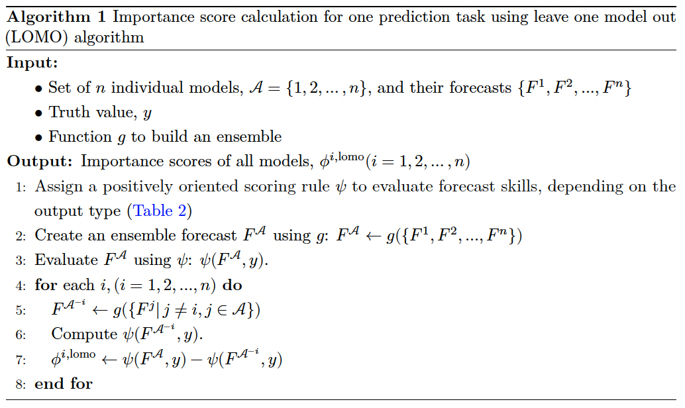
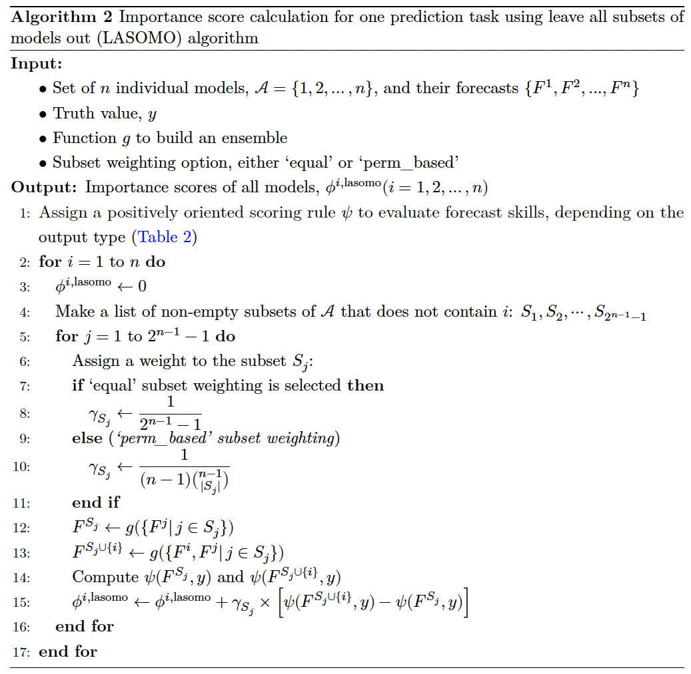

```{r, include = FALSE}
knitr::opts_chunk$set(
  collapse = TRUE,
  comment = "#>",
  fig.width = 7,
  fig.height = 4,
  warning = FALSE,
  message = FALSE
)
options(width = 200)
library(dplyr)
library(tidyr)
library(ggplot2)
library(kableExtra)
library(modelimportance)
```

## Abstract
Ensemble forecasts are commonly used to support decision-making and policy 
planning across various fields because they often offer improved accuracy and 
stability compared to individual models. As each model has its own unique 
characteristics, understanding and measuring the value each constituent model 
adds to the overall accuracy of the ensemble can support the construction of 
effective ensembles. @kim2024 introduced metrics to quantify how each component 
model contributes to the accuracy of ensemble performance and demonstrated their
use in the context of probabilistic forecasting.
Building on this work, the `modelimportance` package provides tools for extended
applications, embracing both point and probabilistic forecasts.
It supports multiple functionalities, allowing users to specify which ensemble 
approach to implement and which model importance metric to use. 
Additionally, the software offers customizable options for handling missing 
values. These features enable the package to serve as a versatile tool for 
researchers and practitioners. It helps not only in constructing an effective 
ensemble model across a wide range of forecasting tasks, but also in 
understanding the role of each model within the ensemble and gaining insights 
into individual models themselves. 
This package follows the 'hubverse' [@hubverse_docs] framework, which is a 
collection of open-source software and tools developed to promote collaborative 
modeling hub efforts and simplify their setup and operation. 
Accordingly, it depends on several packages in the hubverse ecosystem, such as 
`hubUtils`, `hubEnsembles`, `hubEvals`, and `hubExamples`.
Doing so enables seamless integration and flexibility with other forecasting
tools and systems, allowing many analyses to be performed on existing and 
ongoing hubs.


## Introduction {#sec:intro}

Ensemble forecasting is a method to produce a single, consolidated prediction by combining forecasts generated from different models. While each model's strengths are pronounced, its weaknesses are counterbalanced, which leads to an ensemble forecast that is more robust and accurate [@gneiting2005weather; @hastie01statisticallearning].
Specifically, ensembles effectively mitigate the bias and variance arising from the predictions of individual models by averaging them out, and aggregating in this way can reduce prediction errors and improve overall performance. 
Enhanced prediction accuracy and robustness enable the achievement of more reliable predictions, thereby improving decision-making. For this reason, ensemble forecasting is widely used across various domains such as weather forecasting [@Guerra_2020; @gneiting2005weather], financial modeling [@SUN2020101160; @math11041054], and infectious disease outbreak forecasting [@ray_prediction_2018; @reich_accuracy_2019; @lutz_applying_2019; @viboud_rapidd_2018]. For example, throughout the COVID-19 pandemic, the US COVID-19 Forecast Hub collected individual models developed by over 90 different research groups and built a probabilistic ensemble forecasting model for COVID-19 cases, hospitalizations, and deaths in the US based on those models’ predictions, which served as the official short-term forecasts for the US Centers for Disease Control and Prevention (CDC) [@cramer2022united].

The quality of forecasts is assessed by evaluating their error, bias, sharpness, and/or calibration using different scoring metrics.
The selection of the scoring metrics depends on the type of forecast: 
point forecasts (e.g., mean, median) and probabilistic forecasts (e.g., quantiles, samples, predictive cumulative distribution functions, probability mass function).
Commonly used assessment tools for point forecasts are the mean absolute error (MAE) and the mean squared error (MSE), which calculate the average magnitude of forecast errors. 
Scoring metrics for probabilistic forecasts consider the uncertainty and variability in predictions and provide concise evaluations through numerical scores [@gneiting_strictly_2007].  Some examples include the weighted interval score (WIS) for the quantile-based forecasts and the continuous ranked probability score (CRPS) for the forecasts taking the form of predictive cumulative distribution functions [@bracher_evaluating_2021]. We note that CRPS is a general scoring rule that can be computed either analytically in closed form or numerically from samples, and WIS is a quantile-based approximation of CRPS.

Several [R]{.proglang} packages have been developed for this purpose. To name a few, the [fable]{.pkg} package [@Rpackage-fable] is widely used for univariate time series forecasting and includes functions for accuracy measurement. The [Metrics]{.pkg} [@Rpackage-Metrics] and [MLmetrics]{.pkg} [@Rpackage-MLmetrics] provide a wide range of performance metrics specifically designed for evaluating machine learning models. The [scoringRules]{.pkg} [@Rpackage-scoringRules] package offers a comprehensive set of proper scoring rules for evaluating probabilistic forecasts and supports both univariate and multivariate settings. 
The [scoringutils]{.pkg} [@bosse2022evaluating] package offers additional features to the functionality provided by
[scoringRules]{.pkg}, which makes it more useful for certain tasks, such as summarizing, comparing, and visualizing forecast performance. 
These packages have been valuable to evaluate individual models as independent entities, using performance metrics selected for each specific situation or problem type. However, they do not measure the individual models' contributions to the enhanced predictive accuracy when used as part of an ensemble. 
@kim2024 demonstrate that a model's individual performance does not necessarily correspond to its contribution as a component within an ensemble.
Our developed package introduces this capability.
The [modelimportance]{.pkg} package provides tools to evaluate the role of each model as an ensemble member within an ensemble model, rather than focusing on the individual predictive performance per se. 

In ensemble forecasting, certain models contribute more significantly to the overall predictions than others. Assessing the impact of each component model on ensemble predictions is methodologically similar to determining variable importance in traditional regression and machine learning models, where variable importance measures evaluate how much individual variables decrease in accuracy of the model's predictive performance or reduce the average loss. [R]{.proglang} packages such as [randomForest]{.pkg} [@Rpackage-randomForest], [caret]{.pkg} [@Rpackage-caret], [xgboost]{.pkg} [@Rpackage-xgboost], and [gbm]{.pkg} [@Rpackage-gbm] implement these functions for different types of models: random forest models, general machine learning models, extreme gradient boosting models, and generalized boosted regression models, respectively.
These packages focus on feature-level importance within a single model and do not measure the contribution of individual models within an ensemble. The [modelimportance]{.pkg} package addresses this limitation.
The tools in the [modelimportance]{.pkg} quantify how each component model helps enhance the ensemble model's predictive performance. They assign numerical scores to each model based on a selected metric that measures forecast accuracy, depending on the forecast type.


These capabilities provide unique support for hub organizers who refer to the entity responsible for launching and managing a collective modeling hub. They coordinate multiple teams to produce forecasts and integrate their predictions into an ensemble forecast [@Shandross2024], which, as mentioned earlier, is known for having better performance compared to individual models. Examples include the US CDC and the European Centre for Disease Prevention and Control. 
The [modelimportance]{.pkg} package can even strengthen the benefits of a multi-model ensemble by helping these organizations create more effective ensemble forecasts based on the precise evaluation of each model's contribution. Specifically, [modelimportance]{.pkg} follows 'hubverse' standards, where 'hubverse' offers a set of publicly available software and data tools developed to promote collaborative modeling hub efforts and reduce the effort required to set up and operate them [@hubverse_docs]. Adherence to the model output formats specified by the hubverse convention enables many analyses to be performed on existing and ongoing hubs by seamless integration and flexibility with other forecasting tools and systems.  We note that there are over a dozen active hubs running as of fall 2025, with more in planning stages.

We highlight some strong development practices we employed, such as unit testing of individual functions, continuous integration testing on different operating systems, and independent code review. This emphasis on quality control is a key strength of this work and distinguishes it from other academic software development projects.

The paper proceeds as follows. \hyperref[sec:data]{Section~\ref{sec:data}} describes how the \pkg{modelimportance} package relates to the hubverse framework, including its dependencies, the model output formats defined within hubverse, and the structure of data presentation for both forecasts and actual observations. 
\hyperref[sec:algorithms]{Section~\ref{sec:algorithms}} presents two
algorithms implemented in \pkg{modelimportance} for calculating the
model importance metric: leave-one-model-out and
leave-all-subsets-of-models-out. We demonstrate the various
functionalities \pkg{modelimportance} supports in \hyperref[sec:main-functions]{Section~\ref{sec:main-functions}} and highlight our quality assurance measures and its open access in \hyperref[sec:implementation-and-availability]{Section~\ref{sec:implementation-and-availability}}. Some examples are provided in \hyperref[sec:examples]{Section~\ref{sec:examples}}. We close this paper with concluding remarks and a discussion of possible extensions.
 

## Data {#sec-data}

### Relationship and dependencies on hubverse {#subsec:dependence_hubverse}

The [modelimportance]{.pkg} package is designed to work with the hubverse framework and, accordingly, depends on several packages in the hubverse ecosystem, such as [hubUtils]{.pkg} (@Rpackage-hubUtils), [hubEnsembles]{.pkg} (@Rpackage-hubEnsembles), [hubEvals]{.pkg} (@Rpackage-hubEvals), and [hubExamples]{.pkg} (@Rpackage-hubExamples). 
[modelimportance]{.pkg} uses a `model_out_tbl` S3 class as the model output format defined in [hubUtils]{.pkg}, which consists of utility functions to standardize prediction files and data formats (details in \hyperref[subsec:model_output_format]{Section~\ref{subsec:model_output_format}}).
Ensembling predictions from multiple models relies on [hubEnsembles]{.pkg}, which offers a broadly applicable framework to construct multi-model ensembles using various ensemble methods.
Calculation of forecast accuracy using various metrics is based on [hubEvals]{.pkg}, which internally leverages [scoringutils]{.pkg}.
We use the example datasets from [hubExamples]{.pkg}  for testing and demonstration purposes (see \hyperref[sec:examples]{Section~\ref{sec:examples}}). 


### Model output format {#subsec:model_output_format}
Model outputs are structured in a tabular format designed specifically for predictions, which is a formal S3 object called `model_out_tbl`.
In the hubverse standard, each row represents an individual prediction or a component of a prediction for a single task, and its details are described in multiple columns through which one can identify the unique label assigned to each forecasting model, task characteristics, prediction representation type, and predicted values [@Shandross2024]. 
To elaborate on the task characteristics, each prediction task means a specific forecasting problem and it can be described by a set of task ID variables. Examples of such variables include a date on which forecasts are generated, the target to predict (e.g., flu-related incident deaths, cases, or hospitalizations), and the prediction horizon, which is the length of time into the future from the point when a model generate its forecast, for a specific location on a certain target date.
@tbl-example-model_output illustrates short-term forecasts of weekly incident influenza hospitalizations in the US for Massachusetts, generated by the model 'Flusight-baseline' on December 17, 2022, in the `model_out_tbl` format.
The `model_id` column lists a uniquely identified model name. All of the `reference_date`, `target`, `horizon`, `location`, and `target_end_date` columns are all referred to as the task ID variables, which together defines the task characteristics.
Note that the forecast generation date and the target date for which the prediction is made are mapped to the `reference_date` and `target_end_date` columns, respectively, and the location is represented based on the FIPS code (e.g., '25' for Massachusetts).
The time length to the `target_end_date`, which is the number of weeks ahead from the `reference_date`, is indicated in the `horizon` column. 
The prediction representation is specified as 'quantile' in the `output_type` column, and details are represented in the `output_type_id` column with seven quantiles of 0.05, 0.1, 0.25,  0.5, 0.75, 0.9, and 0.95 for each target end date.
The predicted value corresponding to each quantile is recorded in the `value` column.


```{r}
#| echo: false
#| label: tbl-example-model_output
#| tbl-cap: "Example of the model output for incident influenza
#| hospitalizations (top 10 rows) extracted from `forecast_outputs` data in the
#| [hubExamples]{.pkg} package."

forecast_data <- hubExamples::forecast_outputs |>
  dplyr::filter(
    output_type %in% c("quantile"),
    location == "25"
  )

forecast_data |>
  filter(
    reference_date == "2022-12-17",
    horizon != 0
  ) |>
  head(10) |>
  knitr::kable(
               format = "html",
               caption = "Table 1: Example of the model output for incident 
               influenza hospitalizations (top 10 rows) extracted from 
               `forecast_outputs` data in the `hubExamples` package.") |>
  kableExtra::kable_styling(
    font_size = 12,
    bootstrap_options = c("striped", "hover", "condensed", "responsive"),
    full_width = TRUE
  )
```

@fig-example-model_output visualize the information on the prediction task provided by @tbl-example-model_output for three models. 
For each model, the quantile-based forecasts are shown for the target end dates of December 24, 2022 (horizon 1), December 31, 2022 (horizon 2), and January 07, 2023 (horizon 3), which were made on December 17, 2022 based on the historical data available as of that date. The prediction intervals defined by the lowest and highest quantiles (0.05 and 0.95) represent the uncertainty of the predictions. To give brief details in the interpretation, the Flusight-baseline model under-predicted the outcomes for the first two target dates (horizon 1 and 2), but it over-predicted the outcome for the last target date (horizon 3). Its prediction intervals are narrow compared to the other two models, which indicates that it is more confident about its predictions. However, two of three prediction intervals (horizons 1 and 2) failed to cover the eventually observed values, implying that the model was apparently overconfident. 

```{r, fig.pos="t"}
#| echo: false
#| label: fig-example-model_output
#| fig.cap: >
#|   Figure 1: Example plot of three distributional forecasts corresponding to
#|   the model output for incident influenza hospitalizations shown in Table 1.
#|   Solid black dots indicate historically available data as of the forecast
#|   generation date, and open black circles indicate the eventually observed
#|   values. The blue dots represent predictive medians and the blue shaded area
#|   represents the corresponding 90% prediction interval defined by the 0.05
#|   and 0.95 quantiles.

target_data <- hubExamples::forecast_target_ts |>
  dplyr::filter(
    target_end_date %in% unique(forecast_data$target_end_date),
    location %in% unique(forecast_data$location),
    target == "wk inc flu hosp"
  )

forecast_data |>
  filter(
    reference_date == "2022-12-17",
    horizon != 0,
    output_type_id %in% c(0.05, 0.5, 0.95)
  ) |>
  pivot_wider(names_from = output_type_id, values_from = value) |>
  rename(lower = "0.05", upper = "0.95", value = "0.5") |>
  ggplot(aes(x = target_end_date)) +
  facet_grid(~model_id) +
  geom_point(aes(y = value, color = "medians"), size = 2) +
  geom_line(aes(y = value, color = "medians"), linewidth = 1) +
  geom_ribbon(
    aes(
      ymin = lower, ymax = upper,
      fill = "#3388FF"
    ),
    alpha = 0.5
  ) +
  geom_point(
    data = target_data |> filter(target_end_date <= "2022-12-17"),
    aes(y = observation, group = 1, color = "obs")
  ) +
  geom_line(
    data = target_data |> filter(target_end_date <= "2022-12-17"),
    aes(y = observation, group = 1, color = "obs")
  ) +
  geom_point(
    data = target_data |> filter(target_end_date > "2022-12-17"),
    aes(y = observation, group = 1, color = "truth"),
    shape = 1, alpha = 1
  ) +
  geom_line(
    data = target_data |> filter(target_end_date > "2022-12-17"),
    aes(y = observation, group = 1, color = "truth"),
    alpha = 0.75
  ) +
  # coord_cartesian(ylim = c(0, 500)) +
  scale_x_date(breaks = target_data$target_end_date, date_labels = "%Y-%m-%d") +
  labs(
    y = "Weekly Hospitalization",
    x = "Date"
  ) +
  scale_color_manual(
    name = "",
    values = c(
      "medians" = "DodgerBlue",
      "obs" = "Black",
      "truth" = "Black"
    ),
    labels = c(
      "Forecast (Predictive median)",
      "Observed data before forecasting",
      "Eventually observed value"
    )
  ) +
  scale_fill_manual("",
    values = "#3388FF",
    labels = "90% Prediction interval"
  ) +
  theme(
    axis.title.x = element_text(size = 8),
    axis.title.y = element_text(size = 8),
    axis.text.x = element_text(size = 6, angle = 90),
    axis.text.y = element_text(size = 8),
    strip.text = element_text(size = 8),
    legend.title = element_blank(),
    legend.text = element_text(size = 8),
    legend.position = "bottom",
    legend.direction = "vertical",
    legend.box = "horizontal"
  )
```


### Forecast data representation {#subsec:model_output}

Generally, quantitative forecasts can be categorized into either point forecasts or probabilistic forecasts. 
For a specific prediction task, point forecasts, represented by a single predicted value, provide a clear and concise prediction, making them easy to interpret and communicate. 
Probabilistic forecasts, on the other hand, provide a probability distribution over possible future values, which inherently involves uncertainty. They are represented in various ways, such as probability mass functions (pmf), cumulative distribution functions (cdf), samples, or probability quantiles (or intervals). 

The `output_type` and `output_type_id` columns in the model output format, as defined by the hubverse convention, specify the forecast structure. 
Only one `output_type` is allowed, and it must be one of the 'mean', 'median', 'quantile', or 'pmf' in the [modelimportance]{.pkg} package: 'mean' or 'median' for point forecasts and 'quantile' or 'pmf' for probabilistic forecasts. 
As aforementioned, `output_type_id` column  identifies addtional detailed information, such as specific quantile levels (e.g., "0.1", "0.25", "0.5", "0.75", and "0.9") for the 'quantile' output type and categorical values (e.g., "low", "moderate", "high", and "very high") for the 'pmf' output type. The predicted values for `pmf` are constrained to be between 0 and 1, indicating the probability at each categorical level, while they are unbounded numeric otherwise.
Different output types correspond to different scoring rules for evaluating a model's prediction performance.
@tbl-pair-output-scoringrule presents the output types and their associated scoring rules supported by the [modelimportance]{.pkg} package.


```{r}
#| echo: false
#| label: tbl-pair-output-scoringrule
#| tbl-cap: "Pairs of output types and their associated scoring rules for evaluating prediction performance."

data.frame(
  "Output Type" = c("mean", "median", "quantile", "pmf"),
  "Scoring Rule" = c("RSE", "AE", "WIS", "Log Score"),
  Description = c(
    "Evaluate using the root squared error (RSE)",
    "Evaluate using the absolute error (AE)",
    "Evaluate using the weighted interval score (WIS)",
    "Evaluate using the logarithm of the probability assigned to the true outcome (LogScore)"
  ),
  check.names = FALSE
) |>
  knitr::kable(format = "html",
               caption = "Table 2: Pairs of output types and their 
               associated scoring rules for evaluating prediction 
               performance.") |>
  kableExtra::kable_styling(font_size = 13,
    bootstrap_options = c("striped", "hover", "condensed", "responsive"),
    full_width = TRUE
  )
```

### Oracle output data {#subsec:oracle_output_data}

The `oracle_output_data` is a data frame that contains the ground truth values for the variables used to define modeling targets. It is referred to as "oracle" because it is formatted as if an oracle made a perfect point prediction equal to the truth.
This data must follow the oracle output format defined in the hubverse standard, which includes independent task ID columns (e.g., `location`, `target_date`), the `output_type` column specifying the output type of the predictions and an `oracle_value` column for the observed values. 
As in the forecast data, if the `output_type` is either `"quantile"` or `"pmf"`, the `output_type_id` column is often required to provide further identifying information. 


The `model_out_tbl` and `oracle_output_data` must have the same task ID columns and `output_type`, including `output_type_id` if necessary, which are used to match the predictions with the ground truth data. 

## Algorithms {#sec:algorithms}

This section provides a brief description of the leave one model out (LOMO) and leave all subsets of models out (LASOMO) algorithms, which are used to compute the model importance score. The basic idea of measuring the importance of each component model is to evaluate the change in ensemble performance when that model is included or excluded in the ensemble construction. More specifically, we compare the performance of an ensemble with and without a specific model for a specific task, and consider the difference in performance as the importance of that model for that task. We apply this idea to many tasks and aggregate the importance scores for that model across all tasks using averages. (Details can be found in @kim2024.) 

LOMO involves creating an ensemble by excluding one component model from the entire set of models. 
Let ${\mathcal A}$ be a set of $n$ models and $F^i$ be a forecast produced by model $i$, where $i = 1,2, \dots, n.$
Each ensemble excludes exactly one model while including all the others. 
$F^{{\mathcal A}^{-i}}$ denotes the ensemble forecast constructed using all forecasts $F^{\mathcal A}$ except $F^i$. 
Model $i$'s importance score using LOMO is calculated as the difference in accuracy, as measured by a specific score, between $F^{{\mathcal A}^{-i}}$ and $F^{\mathcal A}$  (\hyperref[alg:lomo]{Algorithm~\ref{alg:lomo}}). 
For example, when evaluating model 1 within an ensemble of three models ($n=3$), LOMO creates an ensemble forecast $F^{\{2,3\}}$ using only $F^2$ and $F^3$. The performance of this reduced ensemble is then compared to the full ensemble forecast $F^{\{1,2,3\}}$, which incorporates all three models. We note that a model can make an ensemble better or worse, and thus the importance score for model 1 can be positive or negative accordingly.

```{r}
#| echo: false
#| label: algorithm-lomo
#| out.width: '100%'
#| fig.cap: "Algorithm 1: Leave one model out (LOMO)"

```

On the other hand, LASOMO involves ensemble constructions from all possible subsets of models. For each subset $S$ that does not contain the model $i$, $S \cup \{i\}$ plays a role of ${\mathcal A}$ in the LOMO; the score associated with the subset $S$ is the difference of measures between $F^S$ and $F^{S \cup \{i\}}$. Then, all scores are aggregated across all possible subsets that the model $i$ does not belong to (\hyperref[alg:lasomo]{Algorithm~\ref{alg:lasomo}}).
For example, using the earlier setup of three forecast models, LASOMO considers three subsets, which we denote by $S_1=\{2\}$, $S_2=\{3\}$, and $S_3=\{2, 3\}$, to calculate the importance score of model 1 (excluding all subsets that include model 1). The ensemble forecasts $F^{\{2\}}, F^{\{3\}}$, and $F^{\{2,3\}}$ are then compared to $F^{\{1,2\}}, F^{\{1,3\}}$, and $F^{\{1,2,3\}}$, respectively. The performance differences attributable to model 1's inclusion are aggregated, which results in the importance score for model 1. We note that the subsets (e.g., $S_1, S_2,$ and $S_3$) may have different weights during the aggregating process. 


```{r}
#| echo: false
#| label: algorithm-lasomo
#| out.width: '100%'
#| fig.cap: "Algorithm 2: Leave all subsets of models out (LASOMO)"

```

The [modelimportance]{.pkg} package offers two weighting options for subsets: one assigns equal (uniform) weights to all subsets, and the other assigns weights based on their size, similar to the concept of Shapley values in cooperative game theory, which measure a player’s average contribution to all possible coalitions (or, equivalently, over all permutations of players) (@Shapley1953). Users can choose one to evaluate the contribution of each model in a manner suited to their preferred framework.

Algorithms \ref{alg:lomo} and \ref{alg:lasomo} outline the steps to implement LOMO and LASOMO for a single prediction task, respectively.

### Comparison of weighting schemes in LASOMO

The differences in how the two weighting schemes influence the importance scores become more pronounced as the number of models increases.
As described in \hyperref[alg:lasomo]{Algorithm~\ref{alg:lasomo}}, the formulas for their subset weights are 
$$\frac{1}{2^{n-1}-1} \quad\text{and}\quad \frac{1}{(n-1)\binom{n-1}{k}},$$ 
where $k$ is the size of each subset and $n$ is the total number of models.
The equal scheme treats all subsets equally, so medium-sized subsets have considerable influence in the final result, as there are many such subsets. In contrast, the permutation-based scheme adjusts the weights according to the subset size, giving the greatest weight to both the smallest and largest subsets while assigning small weights to the mid-sized subsets. 
Moreover, the weights assigned to the mid-sized subsets under the permutation-based approach decrease much faster with $n$ than those under the equal weighting scheme (see 
\hyperref[sec:appendix]{Appendix~\ref{sec:appendix}} for details). Consequently, when $n$ is large, middle-sized subsets play a dominant role in determining the importance scores under the equal weighting scheme, whereas extreme-sized subsets primarily drive the scores under the permutation-based weighting approach.

Overall, the difference between the two weighting schemes is likely to arise 
mainly from the the extreme-sized subsets when $n$ is large.
This is because the weights given to the mid-sized subsets become increasingly similar, which are very small  values on the order of $10^{-3}$ even when $n=8$, while the weights assigned to the smallest and largest subsets remain substantially different (@fig-lasomo-weights).


```{r, fig.pos="t"}
#| echo: false
#| label: fig-lasomo-weights
#| fig.cap: >
#|   Figure 2:Comparison of weights assigned to a subset. The plot shows the
#|   weights assigned to a subset as the number of models $n$ increases from 2
#|   to 10. The red line represents the weights under the equal weighting scheme
#|   , while the blue and green lines represent the minimum and maximum weights,
#|   respectively, under the permutation-based weighting scheme. The minimum
#|   weight occurs when the subset size is around $(n-1)/2$, and the maximum
#|   weight occurs when the subset size is $n-1$. As the number of models
#|   increases, the weights assigned by the two schemes become increasingly
#|   similar for mid-sized subsets whereas substantial differences remain for
#|   extreme-sized subsets.

data.frame(n = 2:10) |>
  mutate(
    w_eq = 1 / (2^(n - 1) - 1),
    w_perm_min = 1 / ((n - 1) * choose(n - 1, floor((n - 1) / 2))),
    w_perm_max = 1 / (n - 1)
  ) |>
  ggplot(aes(x = n)) +
  geom_line(aes(y = w_eq, color = "eq"), size = 1) +
  geom_line(aes(y = w_perm_min, color = "perm_min"), size = 1) +
  geom_line(aes(y = w_perm_max, color = "perm_max"), size = 1) +
  scale_color_manual(
    name = "Weights",
    values = c(
      "eq" = "#F8766D",
      "perm_min" = "#619CFF",
      "perm_max" = "#00BA38"
    ),
    labels = c(
      eq = expression(w^{
        "eq"
      }),
      perm_min = expression(w^{
        "perm-min"
      }),
      perm_max = expression(w^{
        "perm-max"
      })
    )
  ) +
  scale_x_continuous(breaks = 2:10) +
  labs(
    x = "Number of models (n)",
    y = "Weight assigned to a subset",
    color = "Weighting Scheme"
  ) +
  theme_minimal() +
  theme(
    legend.title = element_text(size = 9),
    legend.position = "bottom",
    legend.spacing.x = unit(0.25, "mm"),
    legend.key.width = unit(0.4, "cm")
  )
```


## Main functions {#sec:main-functions}

In this section, we describe the usage of the function `model_importance()`, where multiple options are available to customize the evaluation framework (@tbl-arguments1, @tbl-arguments2).

### model_importance( )

The `model_importance()` function calculates the importance scores of ensemble 
component models based on their contributions to improving ensemble prediction 
accuracy for each prediction task. It returns a single data frame of importance 
scores combined across all tasks. If a model missed predictions for a specific 
task, an `NA` value will be assigned for that task.

```{r code-model_importance}
#| eval: false
model_importance(forecast_data, oracle_output_data, ensemble_fun,
                 importance_algorithm, subset_wt, min_log_score,
                 ...)
```


The `forecast_data` is a data frame containing predictions and should be or can be coerced to a `model_out_tbl` format, which is the standard S3 class model output format defined by the hubverse convention. If it fails to be coerced to a `model_out_tbl` format, an error message will be returned from [hubUtils]{.pkg}, which provides the function `as_model_out_tbl()` for this purpose. Users may need to manually transform their data to meet the hubverse standards. 

The `oracle_output_data` is a data frame containing the actual observed values of the variables used to specify modeling targets. Details are provided in \hyperref[subsec:oracle_output_data]{Section~\ref{subsec:oracle_output_data}}.

The `ensemble_fun` argument specifies the ensemble method to be used for evaluating model importance, which relies on implementations in the \pkg{hubEnsembles} package (@Rpackage-hubEnsembles).
The currently supported methods are `"simple_ensemble"` and `"linear_pool"`. 
The `"simple_ensemble"` method returns the average of the predicted values from 
all component models per prediction task defined by task IDs, `output_type`, and `output_type_id` columns. 
The default aggregation function for this method is `"mean"`, but it can be 
customized by specifying additional arguments through `...`, such as 
`agg_fun="median"`.
When `"linear_pool"` is specified, ensemble model outputs are created as a 
linear pool of component model outputs. This method supports only an 
`output_type` of `"mean"`, `"quantile"`, or `"pmf"`.

```{r}
#| echo: false
#| label: tbl-arguments1
#| tbl-cap: "Table 3: Description of the arguments for the
#| `model_importance()` function, including their purpose, possible values,
#| and default settings."

tbl_argument1 <- data.frame(
  "Argument" = c(
    "`forecast_data`", "`oracle_output_data`",
    "`ensemble_fun`",
    "`importance_algorithm`", "`subset_wt`",
    "`min_log_score`", "`...`"
  ),
  "Description" = c(
    "Forecasts",
    "Ground truth data",
    "Ensemble method",
    "Algorithm to calculate importance",
    "Method for assigning weight to subsets when using LASOMO algorithm",
    "Minimum value to replace for log score",
    "Optional arguments for `'simple_ensemble'`"
  ),
  "Possible Values" = c(
    "Must be the model output format",
    "Must be the oracle output format",
    "`'simple_ensemble'`, `'linear_pool'`",
    "`'lomo', 'lasomo'`",
    "`'equal', 'perm_based'`",
    "Non-positive numeric",
    "Varies"
  ),
  Default = c(
    "N/A",
    "N/A",
    "`'simple_ensemble'`",
    "`'lomo'`",
    "`'equal'`",
    -10,
    "`agg_fun='mean'`"
  ),
  check.names = FALSE
)


tbl_argument1 |>
  knitr::kable(format = "html", escape = FALSE,
               caption = "Table 3: Description of the arguments for the
               `model_importance()` function, including their purpose, possible
               values, and default settings.") |>
  kableExtra::kable_styling(
    font_size = 13,
    bootstrap_options = c("striped", "condensed", "responsive"),
    full_width = FALSE
  )
```


The `importance_algorithm` argument specifies the algorithm for model importance calculation, which can be either `"lomo"` (leave one model out) and `"lasomo"` 
(leave all subsets of models out). The `subset_wt` argument is employed only for
the `"lasomo"` algorithm. This argument has two options: `"equal"` assigns equal
weight to all subsets and `"perm_based"` assigns weight averaged over all 
possible permutations as in the formula of Shapley values (\hyperref[alg:lasomo]{Algorithm~\ref{alg:lasomo}}). The default values of `importance_algorithm` and `subset_wt` are `"lomo"` and `"equal"`, respectively.

The `min_log_score` argument is relevant only for the `output_type` of `"pmf"`, 
which uses Log Score as a scoring rule. It sets a minimum threshold for log 
scores to avoid issues with extremely low probabilities assigned to the true 
outcome, which can lead to undefined or negative infinite log scores. 
Any probability lower than this threshold will be adjusted to this minimum value
before calculating the importance metric based on the log score. 
The default value is set to -10, following the CDC FluSight thresholding convention [@brooks2018nonmechanistic; @reich_accuracy_2019]. 
Users may choose a different value based on their practical needs. 


### model_importance_summary( )

The `model_importance_summary()` function summarizes the importance scores 
produced by `model_importance()` across tasks for each model.

```{r code-model_importance_summary}
#| eval: false
model_importance_summary(importance_scores, by = "model_id",
                         na_action = c("drop", "worst", "average"),
                         fun = mean, ...)
```

The `importance_scores` is a data frame containing model importance 
scores for individual prediction tasks, as produced by the `model_importance()`
function. 

The `by` argument specifies the grouping variable(s) for summarization. 
The default is `"model_id"` to summarize importance scores for each model. 
Users can also specify other columns present in the `importance_scores` data 
frame as needed.

The `na_action` argument allows for specifying how to handle `NA` values 
generated during importance score calculation for each task, occurring when a 
model did not contribute to the ensemble prediction for a given task by missing 
its forecast submission.
Three options are available: `"worst"`, `"average"`, and `"drop"`. 
In each specific prediction task, if a model has any missing predictions, the 
`"worst"` option replaces the `NA` values with the smallest value among other 
models' importance metrics, while the `"average"` option replaces them with the 
average of the other models' importance metrics in that task. 
The `"drop"` option removes the `NA` values, which results in the exclusion of 
the model from the evaluation for that task.

The `fun` argument specifies a function used to summarize importance scores. 
`fun = mean` is a default choice, but other summary functions are also 
applicable (e.g., `fun = median`).
Additional arguments can be passed to the summary function `fun` through `...`
if needed (e.g., `fun = quantile, probs = 0.25` for a quartile summary).


```{r}
#| echo: false
#| label: tbl-arguments2
#| tbl-cap: "Description of the arguments for the `model_importance_summary()`
#| function, including their purpose, possible values, and default settings."

tbl_argument2 <- data.frame(
  "Argument" = c(
    "`importance_scores`",
    "`by`",
    "`na_action`",
    "`fun`", "`...`"
  ),
  "Description" = c(
    "Model importance scores produced by `model_importance()`",
    "Grouping variable(s) for summarization",
    "Method to handle `NA` values",
    "Function to summarize importance scores",
    "Optional arguments for `fun`"
  ),
  "Possible Values" = c(
    "data frame",
    "grouping variable(s)",
    "`'drop', 'worst', 'average'`",
    "summary function",
    "depends on `fun`"
  ),
  Default = c(
    "N/A",
    "`'model_id'`",
    "`'drop'`",
    "`mean`",
    "N/A"
  ),
  check.names = FALSE
)


tbl_argument2 |>
  knitr::kable(format = "html", escape = FALSE,
               caption = "Table 4: Description of the arguments for the
               `model_importance_summary()` function, including their purpose,
               possible values, and default settings.") |>
  kableExtra::kable_styling(
    font_size = 13,
    bootstrap_options = c("striped", "condensed", "responsive"),
    full_width = FALSE
  )
```

## Implementation and availability {#sec:implementation-and-availability}

This package is implemented in [R]{.proglang} and distributed via CRAN and GitHhub. 
We conducted unit tests using the [testthat]{.pkg} package [@Rpackage-testthat] to ensure that all functions work correctly as expected,  including those used internally. We also performed continuous integration testing using GitHub Actions to maintain functionality across platforms, including Windows, macOS, and Linux. Integrated GitHub Action, we used \pkg{lintr} package to maintain consistent code style, code quality, and detection potential issues. All code changes were systematically reviewed by fellow team members, and this enhanced reliability. 


## Examples {#sec:examples}

The examples in this section illustrate the use of the `model_importance()` function to evaluate the importance of component models within an ensemble, using various combinations of the arguments described in \hyperref[sec:main-functions]{Section~\ref{sec:main-functions}}. We use some example forecast and target data from the [hubExamples]{.pkg} package, which provides sample datasets for multiple modeling hubs in the hubverse format. 

### Example data {#sec:example-data}

The forecast data used here contains forecasts of weekly incident influenza 
hospitalizations in the US for Massachusetts (FIPS code 25) and Texas (FIPS code
48), generated on November 19, 2022. 
These forecasts are for two target end dates, November 26, 2022 (horizon 1), and
December 10, 2022 (horizon 3), and were produced by three models: 
'Flusight-baseline', 'MOBS-GLEAM_FLUH', and 'PSI-DICE'. 
The output type is `median` and the `output_type_id` column has `NA`s as no 
further specification is required for this output type. 
We have modified the example data slightly: some forecasts have been removed to 
demonstrate the handling of missing values. 
Therefore, MOBS-GLEAM_FLUH's forecast for Massachusetts on November 26, 2022, 
and PSI-DICE's forecast for Texas on December 10, 2022, are missing.


```{r code-forecast_data}
#| eval: false
forecast_data
```


```{r forecast_data, tidy = FALSE}
#| echo: false
forecast_data <- hubExamples::forecast_outputs |>
  dplyr::filter(
    output_type %in% c("median"),
    target_end_date %in% as.Date(c("2022-11-26", "2022-12-10"))
  ) |>
  filter(
    !(model_id == "MOBS-GLEAM_FLUH" & location == "25" & target_end_date == as.Date("2022-11-26")),
    !(model_id == "PSI-DICE" & location == "48" & target_end_date == as.Date("2022-12-10"))
  )

forecast_data
```

The corresponding target data contains the observed hospitalization counts for 
these dates and locations.

```{r code-target_data}
#| eval: false
target_data
```

```{r target_data}
#| echo: false
target_data <- hubExamples::forecast_target_ts |>
  dplyr::filter(
    target_end_date %in% unique(forecast_data$target_end_date),
    location %in% unique(forecast_data$location),
    target == "wk inc flu hosp"
  ) |>
  # Rename columns to match the oracle output format
  rename(
    oracle_value = observation
  )

target_data
```


```{r, fig.pos="t"}
#| echo: false
#| label: fig-example-median-lomo
#| fig.cap: >
#|   Figure 3: Plot of three point forecasts (median) and the eventually
#|   observed values from the `forecast_data` and `target_data`  for weekly
#|   incident influenza hospitalizations in Massachusetts (FIPS code 25) and
#|   Texas (FIPS code 48). Colored dots indicate the forecasts by three models,
#|   generated on November 19, 2022. Open black circles indicate the eventually
#|   observed values. MOBS-GLEAM_FLUH's forecast for Massachusetts on November
#|   26, 2022, and PSI-DICE's forecast for Texas on December 10, 2022, are missing.

forecast_data |>
  ggplot(aes(x = target_end_date)) +
  geom_point(aes(y = value, color = model_id), size = 2) +
  facet_wrap(~location,
    scales = "free_y",
    labeller = labeller(location = function(x) paste0("Location: ", x))
  ) +
  geom_point(
    data = target_data,
    aes(y = oracle_value, group = 1, shape = "Observed"),
    alpha = 1, size = 2
  ) +
  scale_x_date(
    breaks = target_data$target_end_date,
    date_labels = "%Y-%m-%d",
    expand = expansion(add = c(5, 5))
  ) +
  scale_color_manual(
    name = "model_id/Observed",
    values = c(
      "Flusight-baseline" = "#619CFF",
      "MOBS-GLEAM_FLUH" = "#00BA38",
      "PSI-DICE" = "#F8766D"
    ),
    limits = c(
      "Flusight-baseline",
      "MOBS-GLEAM_FLUH",
      "PSI-DICE"
    )
  ) +
  scale_shape_manual(values = c("Observed" = 1)) +
  labs(
    y = "Weekly Hospitalization",
    x = "Date"
  ) +
  theme(
    axis.title.x = element_text(size = 9),
    axis.title.y = element_text(size = 9),
    axis.text.x = element_text(size = 9),
    axis.text.y = element_text(size = 9),
    strip.text = element_text(size = 9),
    legend.title = element_blank(),
    legend.text = element_text(size = 8),
    legend.position = "bottom",
    legend.box = "horizontal",
    legend.spacing.x = unit(0.25, "mm"),
    legend.key.width = unit(0.4, "cm")
  )
```

As expected, prediction errors increase at longer horizons due to greater uncertainty, with forecasts for December 10, 2022, showing larger deviations from the observed values compared to those for November 26, 2022.
Additionally, the forecasts for Massachusetts are relatively more accurate compared to those for Texas, which 
tend to have higher errors (@fig-example-median-lomo).


### Evaluation using LOMO algorithm  {#sec:example-lomo}

We quantify the contribution of each model within the ensemble using the `model_importance()` function. 
The following code evaluates the importance of each ensemble member in the 
simple mean ensemble using the LOMO algorithm. 

```{r code-model_importance-lomo}
#| eval: false
model_importance(
  forecast_data = forecast_data,
  oracle_output_data = target_data,
  ensemble_fun = "simple_ensemble",
  importance_algorithm = "lomo"
)
```


This call generates both the result and informative messages, summarizing the 
input data, including the number of dates on which forecasts were produced and 
the number of models with ids as follows.

```r
Forecasts from 2022-11-19 to 2022-11-19 (a total of 1 forecast date(s)).
The available model IDs are:
 	 Flusight-baseline
	 MOBS-GLEAM_FLUH
	 PSI-DICE 
(a total of 3 models)
```

The function output is a data frame containing model ids and their corresponding
importance scores for each prediction task, along with task id columns. 


```{r}
#| label: scores_lomo
#| echo: false
scores_lomo <- model_importance(
  forecast_data = forecast_data,
  oracle_output_data = target_data,
  ensemble_fun = "simple_ensemble",
  importance_algorithm = "lomo"
)

scores_lomo
```


For models that missed forecasts for certain tasks, `NA` values were assigned in 
the importance column for those tasks.

We summarize the importance scores for each model by averaging across all tasks.
`NA` values are removed during the averaging process by setting the `na_action`
argument to `"drop"`.


```{r lomo-NAdrop}
scores_lomo <- model_importance(
  forecast_data = forecast_data,
  oracle_output_data = target_data,
  ensemble_fun = "simple_ensemble",
  importance_algorithm = "lomo"
)

model_importance_summary(
  importance_scores = scores_lomo,
  by = "model_id",
  na_action = "drop",
  fun = mean
)
```

The results show that the model 'PSI-DICE' has the highest importance score, 
followed by 'Flusight-baseline' and 'MOBS-GLEAM_FLUH'.
That is, 'PSI-DICE' contributes the most to improving the ensemble's predictive performance, whereas 'MOBS-GLEAM_FLUH', which has a negative score, detracts 
from the ensemble’s performance.
The low importance score of 'MOBS-GLEAM_FLUH' is mainly due to a substantially 
larger prediction error for Texas on the target end date of December 10, 2022, 
compared to other models, while its missing forecast for Massachusetts for 
November 26, 2022, was not factored into the evaluation. This single large error
significantly affected its contribution score.

Another approach to handling missing values is to use the `"worst"` option for 
`na_action`, which replaces missing values with the worst (i.e., minimum) score 
among the other models for the same task.


```{r lomo-NAworst}
model_importance_summary(
  importance_scores = scores_lomo,
  by = "model_id",
  na_action = "worst",
  fun = mean
)
```


The results show that the importance scores of 'Flusight-baseline' is unchanged 
because it has no missing forecast. 
We observe that the importance score of 'PSI-DICE', which was previously 
positive, has now decreased to a negative value when compared to the evaluation 
using the `"drop"` option for `na_action`. Moreover, 'MOBS-GLEAM_FLUH' still 
ranks the lowest, but the importance score has increased. 
This change is related to the varying forecast accuracy across different tasks.
For the target end date of November 26, 2022, in Massachusetts, most forecasts 
are relatively accurate. 
Thus, even if the 'MOBS-GLEAM_FLUH' is assigned the worst value of importance 
score for its missing forecast, including this value in the averaging is not 
detrimental to the overall importance metric; rather, it is more beneficial than
excluding it. 
In contrast, for the target end date of December 10, 2022, in Texas, the 
forecasts have much larger errors across the board, and assigning the worst 
value of importance score to the missing forecast of 'PSI-DICE' in this task has
a detrimental effect on averaging importance scores. This is because the scale 
of the importance scores is influenced by the magnitude of the prediction 
errors: 
for tasks with small errors, the scores remain moderate, while tasks with large 
errors can yield importance scores of much greater magnitude.

It is also possible to impute the missing scores with intermediate values by 
assigning the average importance scores of other models in the same task. 
This strategy may offer a more balanced trade-off by mitigating the influence of
the missing data without overly penalizing or overlooking them. 

```{r lomo-NAaverage}
model_importance_summary(
  scores_lomo, by = "model_id", na_action = "average", fun = mean
)
```


### Evaluation using LASOMO algorithm {#sec:example-lasomo}

Now we demonstrate the use of the LASOMO algorithm in the evaluation of model 
importance. As we explored the difference of `na_action` options in the previous
LOMO example (\hyperref[sec:example-lomo]{Section~\ref{sec:example-lomo}}), we 
focus on options for `subset_wt`, which specifies how weights are assigned to 
subsets of models when calculating importance scores, with `na_action` fixed to 
`"drop"`.

The following code and corresponding outputs illustrate the evaluation using 
each weighting scheme.

```{r lasomo-NAdrop-equal}
scores_lasomo_eq <- model_importance(
  forecast_data = forecast_data,
  oracle_output_data = target_data,
  ensemble_fun = "simple_ensemble",
  importance_algorithm = "lasomo",
  subset_wt = "equal"
)
model_importance_summary(
  scores_lasomo_eq, by = "model_id", na_action = "drop", fun = mean
)
```


```{r lasomo-NAdrop-perm}
scores_lasomo_perm <- model_importance(
  forecast_data = forecast_data,
  oracle_output_data = target_data,
  ensemble_fun = "simple_ensemble",
  importance_algorithm = "lasomo",
  subset_wt = "perm_based"
)
model_importance_summary(
  scores_lasomo_perm, by = "model_id", na_action = "drop", fun = mean
)
```


In this example, there are only three models ($n = 3$), and the weights do not 
differ significantly between the two weighting schemes. 
Therefore, the resulting outputs show little difference. 
However, in general, with a larger number of models, the two weighting schemes 
may yield quite different importance scores for each model.

In this section, we explored each component model's contribution to the ensemble
accuracy with only three models. An extensive application in more complex 
scenarios with a larger number of models can be found in @kim2024.

## Computational complexity {#sec:computational-complexity}

Content coming soon. This section will describe computational complexity of LOMO and LASOMO algorithms implemented in the package, depending the numbers of models and tasks.

## Summary and discussion {#sec:discussion}

Multi-model ensemble forecasts often provide better accuracy and robustness than single models, and are widely used in decision-making and policy planning across various domains. The contribution of each component model to the accuracy of the ensemble depends on its own unique characteristics. The [modelimportance]{.pkg} package enables the quantification of the value that each component model adds to the ensemble performance in different evaluation contexts. 

The primary function of the package is `model_importance()`, which returns a data frame with component models and their importance metrics. Users can choose the various ensemble methods to apply and model importance algorithm between LOMO and LASOMO. Additionally, customizable options are available for handling missing values. These features enable the package to serve as a versatile tool to aid collaborative efforts to construct an effective ensemble model across a wide range of forecasting tasks. 
We note that unit testing with continuous integration ensures the reliability of all functions and the overall quality of code across multiple platforms. 

There is a room to enhance the current version of this package. Although this package supports four different output types ('mean', 'median', 'quantile, and 'pmf'), other output types are widely used in practice. For example, 'sample' output type is commonly used in the US Flu Scenario Modeling Hub [@FluSMH]. This format includes multiple simulated values (samples) from the forecast distribution. The `output_type_id` is specified for each sample, which typically indexes the samples or indicates their source, depending on the context. The package can be extended to support this output type, which is under consideration for future releases. 
These extensions would aim to broaden the scope of applications in real-world forecasting tasks.


## Acknowledgements {.unnumbered}

We acknowledge Zhian N. Kamvar for debugging and resolving coding issues while developing the package. We are also grateful to Mattew Cornell for his advice on unit testing, which greatly helped us improve the structure and testing our code with a solid understanding of unit testing practices. 


## Appendix {.unnumbered}

### Weights for subsets in LASOMO {#sec:appendix}

In the LASOMO algorithm, two weighting schemes are available for subsets of models in the calculation of model importance scores: equal weights and permutation-based weights.

Let $n$ be the total number of models and $k$ be the size of a subset that does not include the model being evaluated. The formulas for the weights under each scheme are as follows:
\begin{align*}
w^{\text{eq}} &= \frac{1}{2^{n-1}-1}, \\
w^{\text{perm}} &= \frac{1}{(n-1)\binom{n-1}{k}},
\end{align*}
where the superscripts "eq" and "perm" denote the equal and permutation-based weighting schemes, respectively.
The maximum weight under the permutation-based scheme occurs when $k=n-1$, which is ${1}/{(n-1)}$. The minimum weight occurs when the subset size is around ${(n-1)}/{2}$ (i.e., $k=\lfloor (n-1)/2 \rfloor$), which is approximately $\displaystyle\frac{\sqrt{\pi(n-1)/2}}{(n-1)2^{n-1}}$ by Stirling's approximation.

Given a fixed mid-sized subset, as $n$ increases, the weight assigned to this subset under the equal weighting scheme decreases at a rate of $O({1}/{2^n})$, while under the permutation-based scheme, it decreases at a much faster rate of $O({1}/({\sqrt{n}\,2^n}))$. This indicates that as the number of models grows, that mid-sized subset becomes significantly less influential in determining model importance scores when using the permutation-based weighting scheme compared to the equal weighting scheme.

On the other hand, for subsets of extreme sizes (e.g., $k=1$ or $k=n-1$), the weights under permutation-based weighting scheme decrease only at $O({1}/{n})$, much slower under the equal weighting scheme. This implies that in scenarios with a large number of models, the contributions of these extreme-sized subsets play a relatively larger role in the calculation of model importance scores when using permutation-based weights compared to the equal weighting approach.


## References
